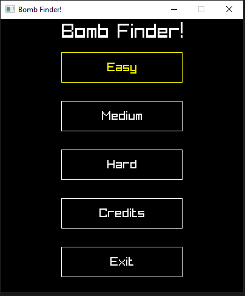
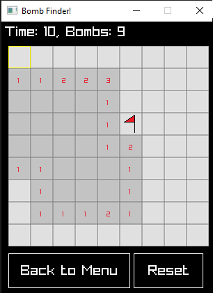
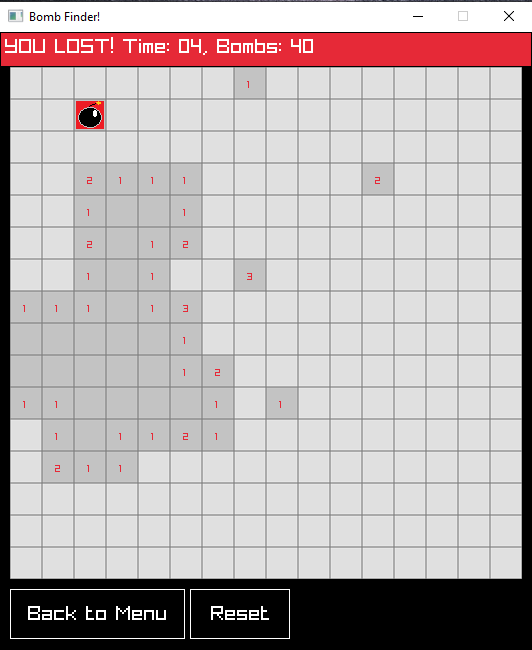

# Bomb Finder
## Overview
Bomb Finder is a Minesweeper clone made with C# and raylib.

## Commands to Run
* git clone https://github.com/CodeOnARaft/BombFinder.git
* cd bombfinder
* dotnet run

## Credits

### Game Library
[raylib](https://www.raylib.com/)
\
\
**All music and sound effects courtesy of [OpenGameArt.org](http://www.opengameart.org)** 

### Sound effects 
https://opengameart.org/content/gui-sound-effects

### Music 

https://opengameart.org/content/loading-screen-loop  (Title Screen)\
https://opengameart.org/content/deep-space  (Game Screen)\
https://opengameart.org/content/party-sector  (Credits Screen)